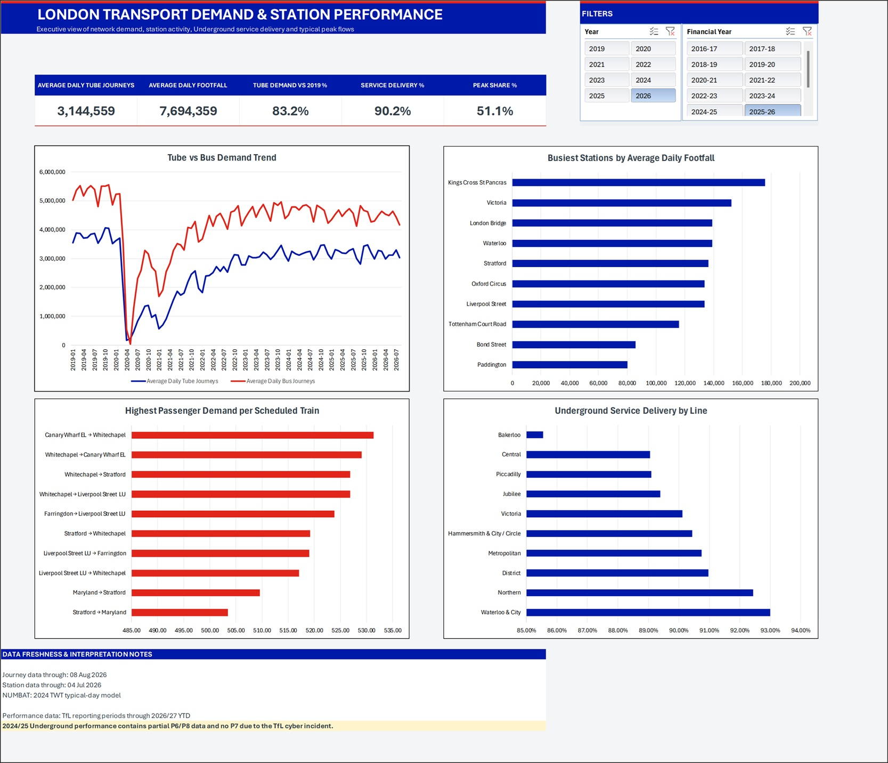
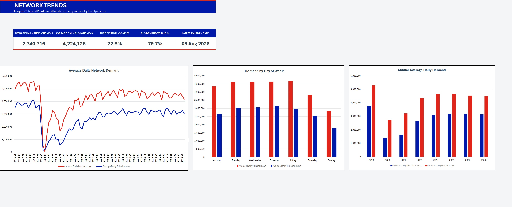
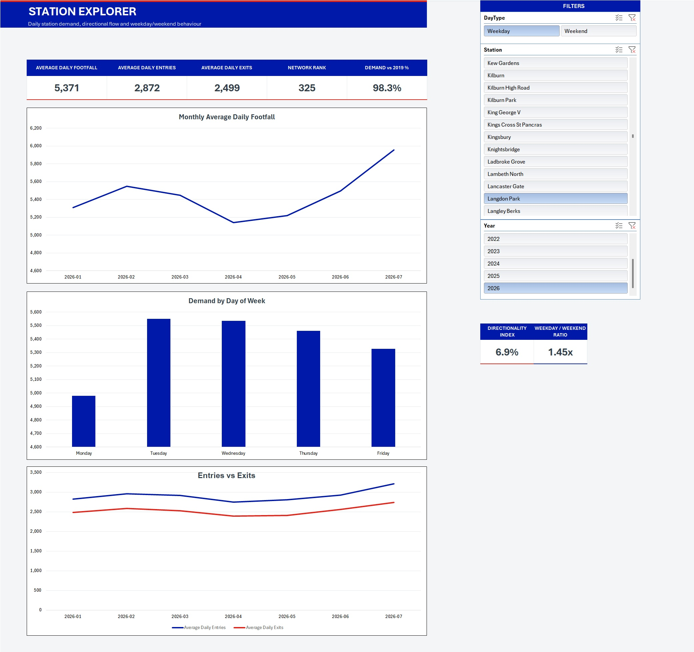
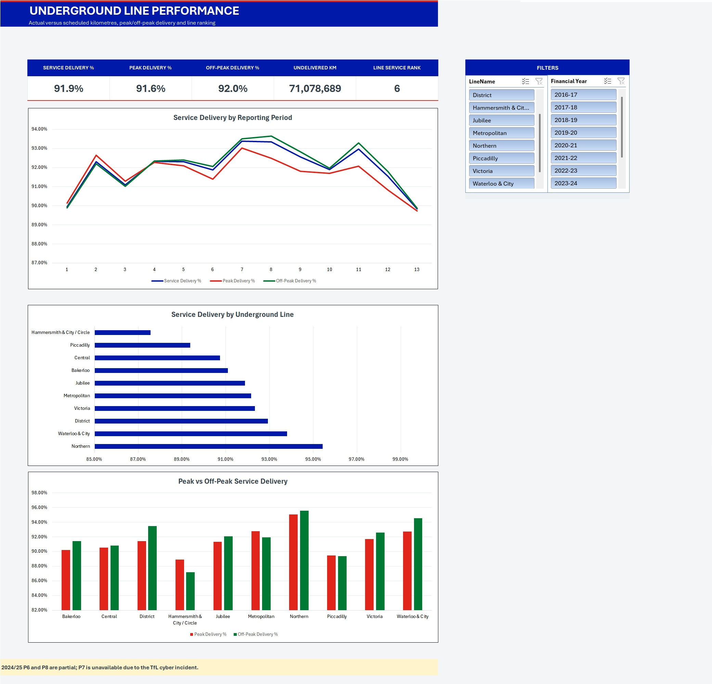
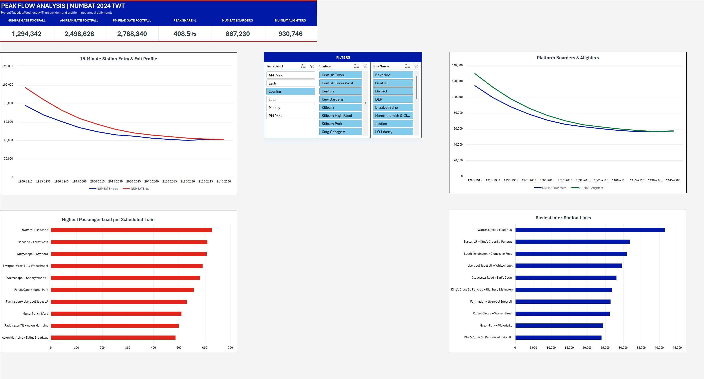

# London Transport Demand & Station Performance

An Excel analytics project exploring London transport demand, station usage, passenger flows and London Underground operational performance using Transport for London data.

## Project goal

The project was built to show Excel as a complete analytical stack rather than only a reporting tool. Raw TfL files are ingested and cleaned in Power Query, modelled in Power Pivot, analysed with DAX, and surfaced through interactive PivotTables, PivotCharts and slicers.

The workbook answers five practical questions:

1. How have Tube and Bus demand changed since 2019?
2. Which stations carry the highest daily footfall and how do entry/exit patterns differ?
3. How does demand vary across weekdays, months and selected stations?
4. How much of the scheduled Underground service is actually operated by line and reporting period?
5. Where does NUMBAT indicate the highest typical 15-minute passenger flows and passengers per scheduled train?

## Headline findings

- **The pandemic shock was much larger on the Tube than on buses.** Average daily Tube journeys fell from about **3.78m in 2019 to 1.39m in 2020 (-63.2%)**, while Bus journeys fell from about **5.30m to 2.70m (-49.1%)**.
- **Demand has recovered substantially but remains below the 2019 baseline.** In 2025, average daily Tube demand was about **84.8% of 2019** and Bus demand about **85.6% of 2019**. The 2026 YTD cached view is about **83.2%** and **84.7%** respectively.
- **The weekday profile is strongly directional.** Across the modelled daily data, Thursday has the highest Tube average and Friday the highest Bus average; Sunday is the lowest-demand day for both modes.
- **The 2026 YTD cached station ranking is led by King's Cross St Pancras** at roughly **175.9k average daily footfall**, followed by Victoria and London Bridge.
- **The cached 2025-26 Underground service view shows meaningful line variation.** Overall service delivery is about **90.2%** in that view, with Waterloo & City and Northern at the top of the ranking and Bakerloo at the bottom.
- **NUMBAT highlights the Elizabeth line corridor around Whitechapel as a high-intensity link.** In the all-day cached ranking, Canary Wharf EL → Whitechapel is around **531 passengers per scheduled train**. This is a demand-intensity metric, not a capacity-utilisation percentage.

## Dashboard walkthrough

### Network Trends
Shows the recovery path for Tube and Bus demand, alongside weekday and annual comparisons.

### Station Explorer
Provides station-level KPIs, monthly footfall, weekday profiles, entry/exit comparisons and interactive slicers.

### Line Performance
Compares actual versus scheduled Underground service delivery by reporting period and line, including peak and off-peak performance.

### Peak Flow Analysis
Uses NUMBAT 2024 TWT data to examine quarter-hour station flows, platform movements and high-intensity links.

## Data sources

The project uses four Transport for London source families:

| Source | Coverage in workbook | Use |
|---|---|---|
| Network Journeys | 01 Jan 2019 - 08 Aug 2026 | Daily Tube and Bus demand |
| Station Footfall | 01 Jan 2019 - 04 Jul 2026 | Daily station entries and exits |
| Kilometres Operated | 2016/17 - 2026/27 YTD | Actual vs scheduled Underground service |
| NUMBAT 2024 TWT | Typical 2024 Tue/Wed/Thu day | 15-minute station, platform and link demand |

Official source pages:

- TfL Network Demand Data: https://tfl.gov.uk/corporate/publications-and-reports/network-demand-data
- TfL Underground Services Performance: https://tfl.gov.uk/corporate/publications-and-reports/underground-services-performance
- TfL Open Data / NUMBAT: https://tfl.gov.uk/info-for/open-data-users/our-open-data
- TfL crowding/open-data file store: https://crowding.data.tfl.gov.uk/

See [Data Sources](docs/DATA_SOURCES.md) for the full source register and refresh notes.

## Methodology

### Power Query

Power Query is used to:

- combine yearly CSV files from folders;
- standardise `DayOFWeek` / `DayOfWeek` schemas;
- convert `YYYYMMDD` text/integer dates into real date values;
- trim station names and apply controlled aliases;
- clean TfL kilometre fields and preserve non-standard periods as null/flagged records rather than forcing zeros;
- reshape NUMBAT's 96 quarter-hour columns into long analytical fact tables;
- create reusable date, station, line, quarter-hour and link dimensions.

### Power Pivot / DAX

The Data Model separates dimensions from fact tables. DAX measures calculate average daily demand, recovery versus 2019, station ranking, service delivery, peak/off-peak delivery, directionality, NUMBAT boarders/alighters and passengers per scheduled train.

See [Formula & Query Guide](docs/FORMULA_GUIDE.md) for the main Excel formulas, DAX measures and Power Query patterns.

## Workbook architecture

The workbook follows the same logical separation as a production analytical model, while avoiding million-row raw-data worksheets:

| Logical layer | Workbook implementation |
|---|---|
| **Start Here** | `README` |
| **Inputs / reference data** | `Source Register`, `Lookups`, slicer selections |
| **Raw Data** | External TfL CSV/XLSX source pack; never manually edited |
| **Power Query Output** | Connection-only queries and Data Model fact/dimension tables |
| **Calculations** | DAX measures + `Pivot Support` |
| **Dashboards** | Executive Dashboard, Network Trends, Station Explorer, Line Performance, Peak Flow Analysis |
| **Audit / documentation** | Data Quality, Methodology, Source Register |

This project is observational rather than a scenario model, so it does **not** contain manual assumption/input cells. The user controls are slicers and filters instead.

See [Workbook Architecture](docs/WORKBOOK_ARCHITECTURE.md) for the model map.

## How to use the workbook

1. Open the cached portfolio workbook in desktop Excel.
2. Start from the `README` sheet and use the workbook guide.
3. Use the slicers on each dashboard to change Year, Station, Day Type, Financial Year, Underground Line, NUMBAT Line and Time Band.
4. Clear slicers to return to broader network views.
5. Do **not** refresh unless you also have the TfL source files and repoint the local Power Query paths.

**Portfolio build refresh:** 17 Aug 2026 15:38. Source-specific freshness is shown separately because the source families update on different schedules.

## Files in this repository

- [`workbook/London_Transport_Demand_Analytics_Portfolio.xlsx`](workbook/London_Transport_Demand_Analytics_Portfolio.xlsx) — clean cached workbook for reviewers
- [`docs/London_Transport_Project_Summary.pdf`](docs/London_Transport_Project_Summary.pdf) — 3-page project summary
- [`docs/FORMULA_GUIDE.md`](docs/FORMULA_GUIDE.md) — important Excel, DAX and Power Query logic
- [`docs/WORKBOOK_ARCHITECTURE.md`](docs/WORKBOOK_ARCHITECTURE.md) — workbook and model structure
- [`docs/DATA_SOURCES.md`](docs/DATA_SOURCES.md) — source register and coverage notes
- [`assets/`](assets/) — screenshots of the finished workbook dashboards

## Data quality and limitations

- Daily journey and station-footfall source dates differ; the workbook therefore shows source-specific freshness rather than one misleading global data-through date.
- Missing station-day rows are not manufactured as zeros.
- Controlled station aliases are used rather than blanket text replacement.
- 2024/25 Underground P6 and P8 are partial and P7 is unavailable due to the TfL cyber incident.
- NUMBAT 2024 TWT is a typical autumn Tuesday/Wednesday/Thursday profile, not an annual daily total.
- `Passengers per Scheduled Train` is not train occupancy or capacity utilisation because train capacity is not part of the model.
- The cached workbook can be reviewed without source configuration; a refresh requires access to the original source pack and local path mapping.

## Tools demonstrated

**Excel · Power Query · Power Pivot · DAX · PivotTables · PivotCharts · Slicers · Data Quality Controls · Relational Data Modelling**

Data provided by Transport for London.
